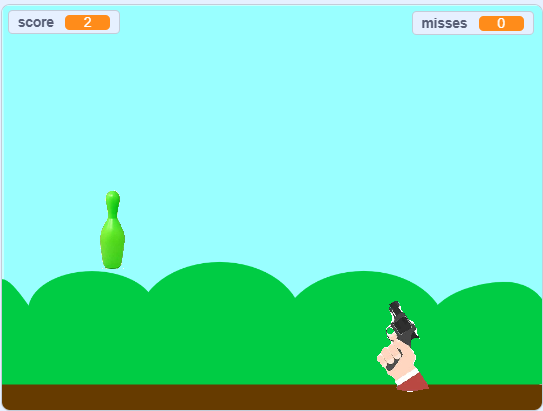
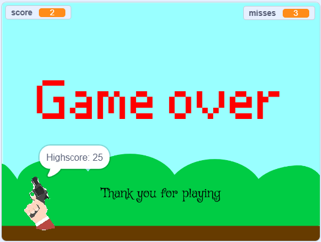

# 🎯 Bottle Shooter — Scratch Game

Bottle Shooter is an arcade-style reaction game where the player shoots randomly appearing bottles before they disappear. The game gradually increases difficulty and features an instruction screen, gameplay screen, and a game over screen with score summary.

---

## 🕹 Game features

Sprites
- Gun – follows mouse, handles recoil and firing
- Bullet – uses clones to animate projectile
- Bottle – spawns at random positions using custom block
- ScoreDisplay – shows final score and highscore

Stage
- Manages backdrops
- Controls game state
- Handles transitions between:
- Instructions
- Gameplay
- Game Over

---

## 🔧 Key Scratch Concepts Used

✔ Broadcast messaging
✔ Cloning
✔ Custom blocks
✔ Timers
✔ Nested conditionals
✔ State variables (gamerunning)
✔ Randomization
✔ Backdrop management
✔ Event-driven programming  

---

## 🧮 Variables

- score – number of bottles hit
- misses – number of bottles missed
- highscore – max score during session
- speed – bottle timing
- hitflag – prevents double hit/miss
- gamerunning – master control of game flow

---

## 🚀 How the Game Works

1. Game starts on Instructions screen
2. Player presses space → game begins
3. Player moves gun with mouse and shoots with space
4. Bottles appear for limited time
5. Score and misses are tracked
6. At 3 misses → Game Over screen
7. Final and high score displayed

---

## 🧹 Bug Fixes Implemented

- Stopped first accidental bullet created during backdrop transition
- Prevented “4th miss” after game ended
- Ensured bullets only fire when gamerunning = 1
- Stopped bottle logic immediately on game over 
- This game is a great example of applying Scratch logic to interactive gameplay.

---

## 🧑‍💻 Created For

- Harvard CS50x – Problem Set 0
- Uploaded to Scratch and GitHub as part of portfolio

---

## 📜 License

Open-source, MIT License.

---

## 📸 Screenshots / Preview

